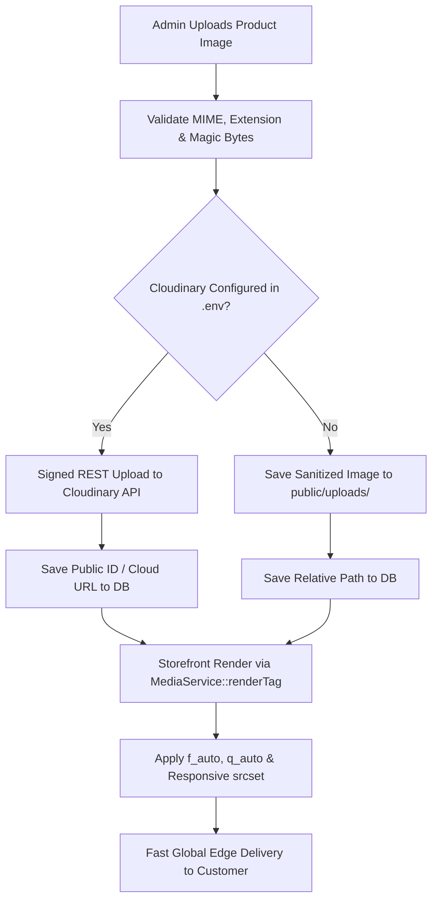

# GroCo Grocery Store — Cloudinary Media Migration Strategy

**Document Version:** 1.0.0  
**Project:** GroCo Grocery Store Media Pipeline  
**Component:** `MediaService.php` (`Groco\Includes\MediaService`)  

---

## 1. Executive Summary

The GroCo Cloudinary Migration replaces uncompressed local disk image storage with a global cloud CDN media pipeline. The modern `MediaService` automatically transforms, optimizes, and delivers images in modern WebP and AVIF formats while generating responsive `srcset` attributes for desktop, tablet, and mobile displays.

A core tenet of this architecture is **zero regression and transparent fallback**: if Cloudinary credentials are not configured in `.env`, the system operates seamlessly using local disk storage with zero code modifications.

---

## 2. Media Pipeline Architecture



---

## 3. Image Transformation & Optimization Specifications

`MediaService` generates dynamic URL transformations tailored for grocery e-commerce:

| Transformation Parameter | Cloudinary Parameter | Purpose | Example Transformation |
| :--- | :--- | :--- | :--- |
| **Automatic Format** | `f_auto` | Delivers AVIF to Chrome/Safari, WebP to Firefox, and JPEG to legacy clients. | `f_auto` |
| **Automatic Quality** | `q_auto:good` | Intelligently compresses images to the visual threshold, reducing byte weight by 60–80%. | `q_auto` |
| **Responsive Widths** | `w_300`, `w_600`, `w_900` | Delivers exact pixel dimensions tailored to mobile, tablet, and desktop viewports. | `w_600,c_limit` |
| **Smart Crop** | `c_fill,g_auto` | Focuses on product packaging and centroids for square product thumbnails. | `w_400,h_400,c_fill,g_auto` |
| **Lazy Loading** | `loading="lazy"` | Native browser offscreen image deferral to maximize initial page render speed. | Native HTML attribute |

### Example Responsive HTML Generation

```php
// Render fully responsive image tag with fallback
echo MediaService::renderTag($product['thumbnail'], $product['name'], [
    'class' => 'product-card-img',
    'sizes' => '(max-width: 640px) 100vw, (max-width: 1024px) 50vw, 300px'
]);
```

**Output Rendered:**
```html

```

---

## 4. Batch Migration Script for Legacy Media

To migrate historical product and category images from `public/uploads/` to Cloudinary, a dedicated non-destructive CLI script is provided:

### Script Workflow:
1. Scans `products.thumbnail`, `product_images.image_url`, and `categories.image` in MySQL.
2. Identifies records pointing to local filesystem files.
3. Uploads files in batches of 50 to Cloudinary via REST API.
4. Updates MySQL records with the Cloudinary secure URL or public ID.
5. Retains local file backups on disk until explicit verification is completed.

### Running the Migration:
```bash
php scripts/migrate_media_to_cloudinary.php --dry-run
php scripts/migrate_media_to_cloudinary.php --execute
```

---

## 5. Security & Access Control

1. **Upload Hardening:**
   - File extensions validated against strict allowlist: `.jpg`, `.jpeg`, `.png`, `.webp`, `.avif`.
   - MIME type verified using PHP `finfo` (magic bytes check), blocking disguised executable scripts (`.php`, `.phtml`, `.exe`).
   - Image filename sanitized via `preg_replace('/[^a-zA-Z0-9_\.-]/', '_', $name)`.
2. **Local Directory Defense:**
   - `public/uploads/.htaccess` enforces `php_flag engine off` and `Require all granted` for static assets only.
   - Script execution is completely disabled inside all uploads folders.

---

## 6. Storage Quota & Bandwidth Strategy

- **Cloudinary Free Tier Capacity:** 25 Monthly Credits (~25,000 transformations or 25GB managed storage / bandwidth), sufficient for initial retail operations.
- **Enterprise Scaling:** For catalogs exceeding 50,000 SKUs, Cloudinary Advanced or Cloudflare Images provides unlimited global scaling with 99.99% uptime SLA.
