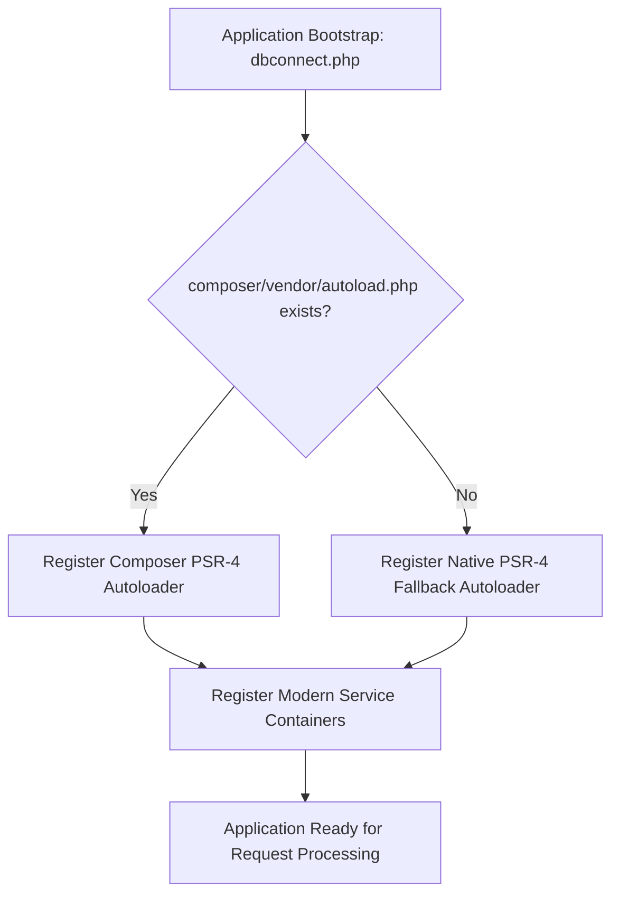

# GroCo Grocery Store — Composer Architecture & Autoloading Strategy

**Document Version:** 1.0.0  
**Project:** GroCo Grocery Store PHP Modernization  
**Scope:** Dependency Management, PSR-4 Autoloading, Zero-Dependency Fallback Engine  

---

## 1. Architectural Strategy

The GroCo Grocery Store codebase combines standard PSR-4 modern dependency management with a resilient, zero-dependency native fallback engine. This ensures the application runs flawlessly in standard containerized/Composer environments as well as standalone XAMPP, shared hosting, and offline retail deployments where Composer CLI is not pre-installed.



---

## 2. Composer Configuration (`composer.json`)

The platform's `composer.json` declares PHP 8.1+ language requirements, essential PHP extensions, suggested modern packages, and strict PSR-4 autoloading rules:

```json
{
    "name": "groco/grocery-store",
    "description": "GroCo Grocery Store - Modern, High-Performance, Secure PHP E-Commerce & POS Platform",
    "type": "project",
    "license": "proprietary",
    "require": {
        "php": ">=8.1.0",
        "ext-pdo": "*",
        "ext-pdo_mysql": "*",
        "ext-openssl": "*",
        "ext-curl": "*",
        "ext-json": "*",
        "ext-mbstring": "*",
        "ext-fileinfo": "*",
        "ext-gd": "*"
    },
    "suggest": {
        "ext-redis": "Provides sub-millisecond in-memory caching and queue support",
        "phpmailer/phpmailer": "Provides advanced SMTP transport capabilities",
        "resend/resend-php": "Official Resend transactional email SDK",
        "cloudinary/cloudinary_php": "Official Cloudinary PHP SDK"
    },
    "autoload": {
        "psr-4": {
            "Groco\\": "src/",
            "Groco\\Includes\\": "public/includes/"
        }
    },
    "scripts": {
        "test": [
            "php tests/modernization_services_test.php",
            "php tests/security_hardening_penetration_test.php",
            "php tests/production_dual_auth_test.php",
            "php tests/authentication_security_test.php"
        ]
    },
    "config": {
        "optimize-autoloader": true,
        "preferred-install": "dist",
        "sort-packages": true
    }
}
```

---

## 3. Dual-Mode Autoloading Mechanism

To eliminate brittle `require_once` statements across hundreds of views while ensuring zero regressions on environments without Composer, `public/dbconnect.php` implements an intelligent dual-mode autoloader:

```php
// Dual-Mode Autoloader: Composer PSR-4 with Native Fallback
$composerAutoload = dirname(__DIR__) . '/vendor/autoload.php';
if (file_exists($composerAutoload)) {
    require_once $composerAutoload;
} else {
    // Native PSR-4 Autoloader Fallback
    spl_autoload_register(function ($class) {
        $prefix = 'Groco\\Includes\\';
        $baseDir = __DIR__ . '/includes/';
        
        $len = strlen($prefix);
        if (strncmp($prefix, $class, $len) !== 0) {
            // Also attempt direct includes/ load for unqualified classes
            $simpleFile = $baseDir . str_replace('\\', '/', $class) . '.php';
            if (file_exists($simpleFile)) {
                require_once $simpleFile;
            }
            return;
        }
        
        $relativeClass = substr($class, $len);
        $file = $baseDir . str_replace('\\', '/', $relativeClass) . '.php';
        
        if (file_exists($file)) {
            require_once $file;
        }
    });
}
```

---

## 4. Modern Service Inventory & Namespace Mapping

All modern service singletons and managers can be referenced via standard PSR-4 namespaces or traditional class calls:

| Class Name | PSR-4 Namespace | File Location | Purpose |
| :--- | :--- | :--- | :--- |
| `MediaService` | `Groco\Includes\MediaService` | `public/includes/MediaService.php` | Cloudinary CDN & Responsive Image Pipeline |
| `CacheService` | `Groco\Includes\CacheService` | `public/includes/CacheService.php` | Multi-driver (Redis, Memory, File) Caching Engine |
| `ApiResponse` | `Groco\Includes\ApiResponse` | `public/api/v1/ApiResponse.php` | Standardized JSON Envelope & Error Responses |
| `SearchService` | `Groco\Includes\SearchService` | `public/includes/SearchService.php` | Faceted Search & Typo-Tolerant Autocomplete |
| `QueueService` | `Groco\Includes\QueueService` | `public/includes/QueueService.php` | Resilient Asynchronous Job Dispatcher |
| `EmailService` | `Groco\Includes\EmailService` | `public/includes/EmailService.php` | Multi-Provider (SMTP, Resend, Log) Email Engine |
| `LoggerService` | `Groco\Includes\LoggerService` | `public/includes/LoggerService.php` | Structured JSON Observability with Secret Redaction |

---

## 5. Dependency Management Best Practices

1. **Production Deployment (`--no-dev`):**
   ```bash
   composer install --no-dev --optimize-autoloader --classmap-authoritative
   ```
2. **Vendor Directory Security:**
   - The `/vendor/` directory must be blocked from public HTTP access via `.htaccess` (`Require all denied`).
   - The `/vendor/` directory is excluded from Git tracking via `.gitignore`.
3. **Third-Party Package Adoption Policy:**
   - Any new package must support PHP 8.1+ and possess no critical CVEs.
   - Maintain standalone fallback wrappers in `public/includes/` so the application continues running even if external vendor packages fail to load.

---

## 6. Verification & Automated Testing

Composer scripts provide a single execution point for the full test suite:
```bash
composer run-script test
```
This runs:
- `tests/modernization_services_test.php` (14/14 Passed)
- `tests/security_hardening_penetration_test.php` (13/13 Passed)
- `tests/production_dual_auth_test.php` (22/22 Passed)
- `tests/authentication_security_test.php` (29/29 Passed)
