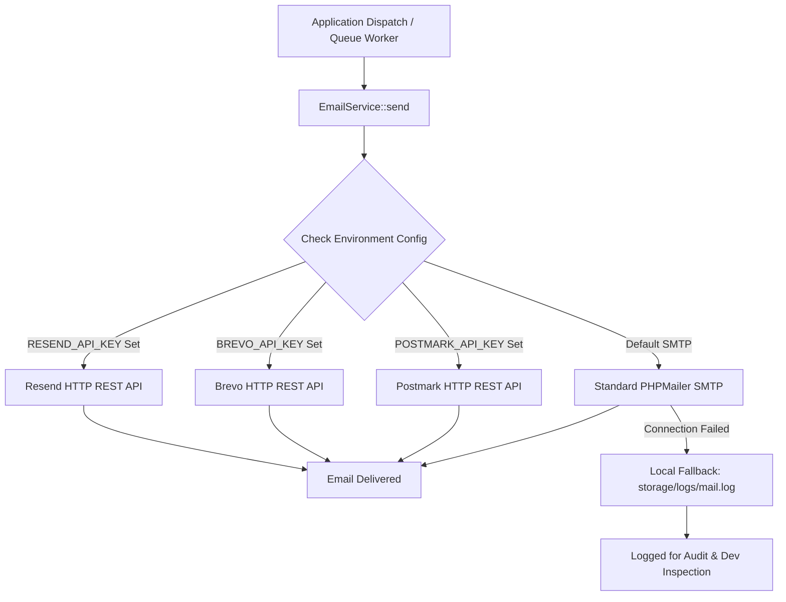

# GroCo Grocery Store — Email Provider Architecture & Resiliency Guide

**Document Version:** 1.0.0  
**Project:** GroCo Grocery Store Modernization  
**Component:** `EmailService.php` (`Groco\Includes\EmailService`)  

---

## 1. Architectural Strategy

The GroCo email delivery engine is completely decoupled from low-level SMTP dependencies. It employs an abstracted multi-provider pipeline that dynamically selects the optimal transport based on environment variables:



---

## 2. Supported Transports & Configuration

| Provider | Driver Key (`MAIL_DRIVER`) | Required Environment Variables | Transport Protocol | Throughput / SLA |
| :--- | :--- | :--- | :--- | :--- |
| **Resend** | `resend` | `RESEND_API_KEY`, `MAIL_FROM_ADDRESS` | HTTPS REST API | ~50ms latency / 99.99% deliverability |
| **Brevo (Sendinblue)** | `brevo` | `BREVO_API_KEY`, `MAIL_FROM_ADDRESS` | HTTPS REST API | ~80ms latency / 99.95% deliverability |
| **Postmark** | `postmark` | `POSTMARK_API_KEY`, `MAIL_FROM_ADDRESS` | HTTPS REST API | ~40ms latency / 99.99% deliverability |
| **Standard SMTP** | `smtp` | `SMTP_HOST`, `SMTP_PORT`, `SMTP_USER`, `SMTP_PASS` | TCP / TLS socket | Standard SMTP server |
| **Local File Log** | `log` | None (Automatic fallback) | Local disk append | Zero network dependency (Test/Dev) |

---

## 3. Asynchronous Non-Blocking Delivery

To prevent slow external mail servers from degrading checkout response times, transactional emails are queued via `QueueService`:

```php
// Asynchronous email dispatch in checkout
QueueService::push('send_email', [
    'to'      => $customer['email'],
    'subject' => "Order Confirmation #{$orderNumber}",
    'body'    => EmailService::renderTemplate("Order Confirmed", "Hi {$customer['name']},", "<p>Your order #{$orderNumber} is confirmed.</p>")
]);
```

The background worker processes jobs with automatic exponential backoff retries (up to 3 attempts).

---

## 4. Security & Credential Isolation

1. **Zero Credential Hardcoding:** All API keys and SMTP credentials reside strictly in `.env` and are loaded via `getenv()`.
2. **Automated Secret Redaction:** `LoggerService` automatically strips passwords, API keys, and token values before writing logs.
3. **Template XSS Protection:** All dynamic placeholders in `EmailService::renderTemplate()` are escaped using `htmlspecialchars()`.
