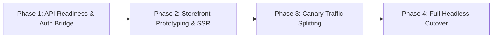
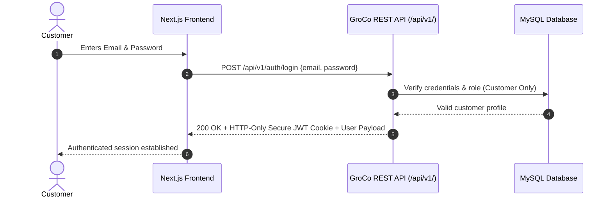

# GroCo Grocery Store — Headless Storefront Migration Plan (Next.js / React)

**Document Version:** 1.0.0  
**Project:** GroCo Grocery Store Headless Architecture  
**Target Frontend Stack:** Next.js 14+ (App Router, React 18+, Tailwind CSS, TypeScript)  
**Backend API:** GroCo PHP 8.2+ REST API v1 (`/api/v1/`)  

---

## 1. Executive Summary & Architecture

The GroCo Headless Architecture decouples the customer-facing e-commerce storefront from the backend business logic and database. The backend PHP 8.2 engine acts as a high-performance headless commerce API, managing inventory, orders, payments, admin ERP, and in-store POS, while Next.js powers a blazing-fast, SEO-optimized web and mobile storefront.

```mermaid
graph TD
    subgraph Frontend Layer [Headless Frontend (Next.js 14+ on Vercel / Node.js)]
        SSR[Server-Side Rendered Pages (SSR)]
        ISR[Incremental Static Regeneration (ISR - Catalog)]
        ClientApp[React Client Components (Cart / Checkout / User)]
    end

    subgraph API Gateway [Reverse Proxy / Cloudflare Edge]
        EdgeCache[Edge CDN Cache]
    end

    subgraph Backend Layer [GroCo Modern PHP 8.2 Core]
        API[GroCo REST API v1 (/api/v1/)]
        AdminERP[Admin ERP & Reporting Dashboard]
        POSModule[In-Store Touch POS & Cashier Shifts]
        AuthEngine[Dual Auth & OAuth Bridge]
    end

    subgraph Persistence Layer [Storage & Caching]
        MySQL[(MySQL 8.0 InnoDB)]
        Redis[(Redis Cache / Memory)]
        Cloudinary[(Cloudinary Media CDN)]
    end

    Frontend Layer -->|HTTPS JSON Requests| EdgeCache
    EdgeCache -->|Pass-Through / Dynamic| API
    AdminERP --> MySQL
    POSModule --> MySQL
    API --> MySQL
    API --> Redis
    Frontend Layer -->|Direct Image Loads| Cloudinary
```

---

## 2. Key Advantages of the Headless Model

1. **Uncompromised Core Systems:** The mission-critical Admin ERP and In-Store POS continue running on native PHP with direct database access, zero latency, and zero risk to thermal printing or barcode scanners.
2. **Superior Mobile UX & Core Web Vitals:** Next.js Server Components and streaming SSR deliver sub-second Largest Contentful Paint (LCP) and zero Cumulative Layout Shift (CLS).
3. **Omnichannel Readiness:** A single `/api/v1/` backend powers web, iOS/Android mobile apps (React Native/Flutter), smart kiosks, and partner integrations.
4. **Independent Deployment Cycles:** Frontend UX/UI updates can be deployed continuously without touching backend PHP code or restarting Apache/MySQL services.

---

## 3. Phased Migration Roadmap



### Phase 1: API Readiness & Contract Testing (Completed)
- **Status:** **COMPLETED**
- Standardized `/api/v1/` endpoints deployed:
  - `GET /api/v1/products` (Faceted search, category/brand filters, pagination)
  - `GET /api/v1/products/{id_or_slug}` (Product detail, multi-image gallery, stock status)
  - `GET /api/v1/categories` (Hierarchical category tree with cached counters)
  - `GET /api/v1/brands` (Brand list with logo URLs)
  - `GET /api/v1/search/autocomplete` (Sub-10ms autocomplete suggestions)
  - `GET /api/v1/cart` & `POST /api/v1/cart/items` (Session/token-backed cart)
- Standardized JSON envelope: `{ "status": "success", "data": [...], "meta": { ... } }`.

### Phase 2: Next.js Storefront Prototyping (Weeks 1–4)
- Initialize Next.js 14+ project with TypeScript and Tailwind CSS.
- Build headless components:
  - Header with live category navigation and instant search modal.
  - Product Listing Page (PLP) using ISR (`revalidate: 60`).
  - Product Detail Page (PDP) with responsive Cloudinary image zoom and dynamic stock indicators.
  - Mobile slide-out cart drawer with optimistic UI updates.
- Customer authentication bridge: JWT token exchange from Google OAuth and standard email/password login.

### Phase 3: Canary & Subdomain Rollout (Weeks 5–6)
- Deploy Next.js frontend to `preview.groco.com` or `shop.groco.com`.
- Route 10% of mobile storefront traffic via Cloudflare Worker / Nginx reverse proxy.
- Verify checkout completion rates, payment gateway webhooks, and analytics parity with Google Tag Manager.

### Phase 4: Production Cutover (Weeks 7–8)
- Route root domain (`groco.com`) to Next.js storefront.
- Retain `/admin/` and `/pos/` routes pointing directly to the PHP backend.
- Set up automated webhook cache invalidation (`POST /api/revalidate?tag=products`) triggered on admin product edits.

---

## 4. Authentication & Session Strategy



- **Customer Auth:** Uses secure, HTTP-only, SameSite cookies containing a signed JWT token or session identifier.
- **Admin & Cashier Separation:** Admin and POS users authenticate exclusively via native PHP sessions at `/admin/login.php` and `/admin/pos.php`. Admin accounts are cryptographically prevented from logging in via the customer API.

---

## 5. SEO & Structured Data Architecture

To ensure zero SEO loss and maximize Google search rankings during and after headless migration:
1. **Server-Side Generation (SSG / ISR):** Category and product pages are pre-rendered on the server, ensuring Googlebot receives complete HTML with zero JavaScript execution delay.
2. **Schema.org JSON-LD:** Next.js renders comprehensive metadata schemas:
   - `Product` (Name, Description, Image, Price, Availability, SKU, GTIN)
   - `BreadcrumbList` (Hierarchical category trail)
   - `Organization` and `LocalBusiness` (Store locations, opening hours, contact)
3. **Dynamic XML Sitemap:** Automatically generated from `/api/v1/products` and `/api/v1/categories` with hourly revalidation.
4. **Canonical Tag Standardization:** Self-referencing canonical URLs on all pages to prevent duplicate content penalties.

---

## 6. Offline Support & Edge Caching

- **Next.js PWA:** Integrated Workbox service worker providing offline browsing for previously viewed catalog items.
- **Edge Caching Rules:**
  - Static Assets (`/_next/static/*`): Cached for 1 year (`Cache-Control: public, max-age=31536000, immutable`).
  - Catalog Pages (ISR): Edge cached for 60 seconds with stale-while-revalidate.
  - Cart, Checkout, User Account: `Cache-Control: private, no-cache, no-store`.

---

## 7. Migration Risk Assessment & Mitigation

| Risk Scenario | Probability | Impact | Mitigation Strategy |
| :--- | :--- | :--- | :--- |
| **Session Desynchronization** | Low | Medium | Unified token bridge with secure cookie sharing across domains. |
| **Cart Stock Discrepancy** | Low | High | Atomic stock reservation in PHP backend during `POST /api/v1/checkout/orders`. |
| **SEO Ranking Fluctuation** | Low | High | 1:1 URL slug mapping, 301 redirects for legacy URLs, identical JSON-LD schema. |
| **Payment Gateway Webhook Lag** | Low | Medium | Asynchronous `QueueService` webhook handler with automatic exponential retries. |
