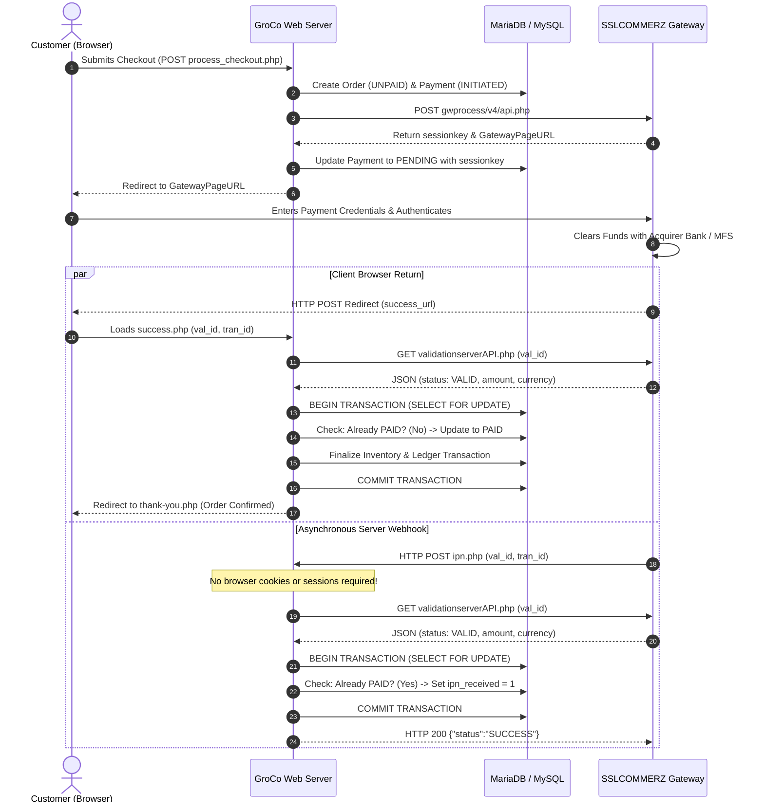

# GroCo Grocery Store — Dual Callback & IPN Flow Architecture

## 1. Sequence Diagram: Dual Notification Model

In SSLCOMMERZ V4, transaction completion triggers two parallel notification mechanisms:
1. **Client Return Callback**: Customer's browser is redirected to `success_url` (`public/payment/sslcommerz/success.php`).
2. **Server-to-Server IPN**: An asynchronous HTTP POST dispatched from SSLCOMMERZ servers directly to `ipn_url` (`public/payment/sslcommerz/ipn.php`).

---

## 2. Sessionless IPN Execution Principle

A common flaw in rudimentary integrations is relying on `$_SESSION` inside webhook listeners. Because IPN requests originate directly from SSLCOMMERZ gateway servers (`202.51.x.x` or similar), customer browser cookies and sessions **DO NOT EXIST**.

`public/payment/sslcommerz/ipn.php` strictly adheres to:
1. Identification by Payload: Payment records are resolved solely via `tran_id` or `val_id`.
2. Header Independence: No expectation of session IDs, CSRF cookies, or user login tokens.
3. Clean HTTP Responses: Emits strictly JSON `{"status": "SUCCESS"}` with HTTP 200 on validation, or HTTP 422 on invalid payloads, enabling automated gateway retry policies to function predictably.

---

## 3. Webhook Replay Protection

To mitigate duplicate webhook submissions or network retransmissions:
- All raw incoming callbacks and IPN payloads are hashed (`SHA-256`) and recorded in `payment_webhook_events`.
- Duplicate delivery detection checks if an identical payload hash was already received within the transaction window.
- The state machine ensures that duplicate events are recorded for audit purposes without mutating financial state.
