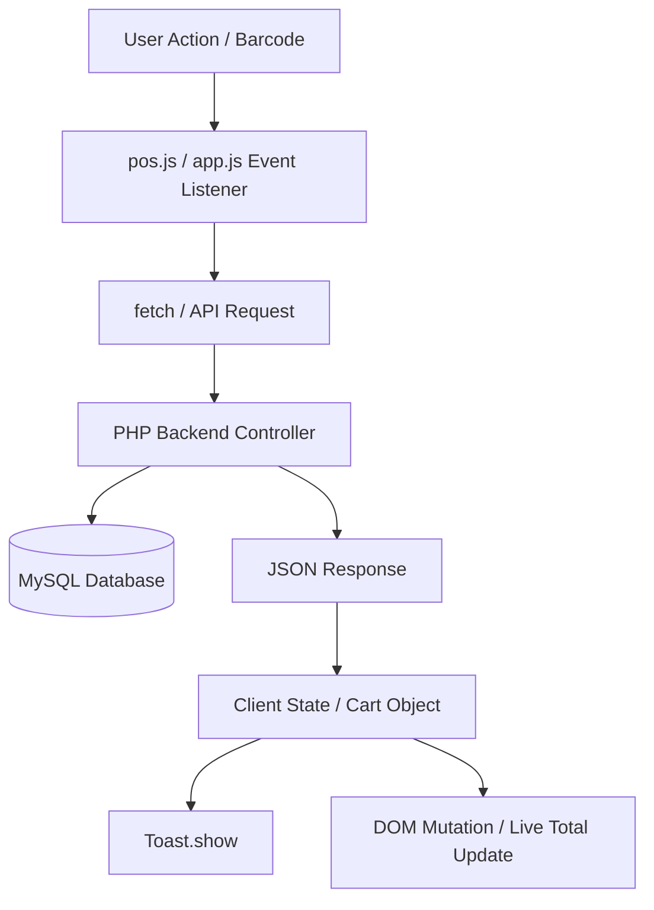

# JavaScript Functionality Specification

## 1. Client-Side Architecture Overview

The GroCo Grocery Store client uses vanilla JavaScript (ES6+) with modular event-driven components. No heavy client-side single-page-application framework (React/Vue) is required, ensuring ultra-fast First Contentful Paint (FCP) and optimal Google PageSpeed scores on low-bandwidth mobile networks in Bangladesh.

### Directory Breakdown:
- `public/assets/js/`: Storefront modules (UI interactions, async cart, toast notifications, search debounce, PWA registration).
- `admin/assets/js/`: Backoffice UI helpers (charts, custom dropdowns, POS terminal scanner listener, order status modals).

---

## 2. Storefront Script Inventory & Detailed Functionality

### 2.1 `app.js` (Core Application Engine)
- **Global Namespace**: `window.GrocoApp`
- **Responsibilities**:
  - Initializes mobile drawer navigation and backdrop overlays.
  - Sticky header scroll listener with throttle/requestAnimationFrame.
  - Global AJAX CSRF token injector for `fetch()` and `XMLHttpRequest`.
  - Language switcher handler (triggers session reload or async locale update).
  - Currency formatter helper: `formatCurrency(amount)` $\rightarrow$ `"৳ " + Number(amount).toFixed(2)`.

---

### 2.2 `cart.js` (Cart & Mini-Cart Controller)
- **Responsibilities**:
  - Event delegation for `.btn-add-to-cart`, `.cart-qty-plus`, `.cart-qty-minus`, and `.cart-item-remove`.
  - Optimistic UI updates with fallback rollback on network error.
  - Floating cart badge counter badge synchronization (`#cart-count-badge`).
  - Slide-in mini-cart drawer renderer and total price calculator.
  - Coupon code submission with inline validation and celebratory discount animation.

---

### 2.3 `search.js` (Live Search & Autocomplete)
- **Responsibilities**:
  - Input event listener on search box with 300ms debounce timer.
  - Category dropdown filter coupling.
  - Floating dropdown result card renderer with product thumbnail, category badge, and live price.
  - Keyboard navigation (Arrow Up / Down, Enter to select, Escape to close).
  - Search history caching in `localStorage` (`groco_recent_searches`).

---

### 2.4 `quickview.js` (Product Quick View Modal)
- **Responsibilities**:
  - Listens for clicks on `.btn-quickview[data-product-id]`.
  - Displays skeleton loader modal while fetching `/public/api/products.php?action=quickview&product_id=X`.
  - Populates product gallery thumbnails, image zoom preview, unit selector, quantity stepper, and "Add to Cart" button.
  - Traps modal focus for accessibility (ARIA compliance).

---

### 2.5 `slider.js` (Banner Carousel & Product Carousels)
- **Responsibilities**:
  - Lightweight touch-swipe enabled slider without external dependencies (or minimal Swiper/Tiny-slider initialization).
  - Auto-play with pause-on-hover for hero promo banners.
  - Responsive breakpoints for multi-item product rows (1 card on mobile $\rightarrow$ 3 on tablet $\rightarrow$ 5 on desktop).

---

### 2.6 `wishlist.js` & `compare.js`
- **`wishlist.js`**:
  - Heart icon click animation and toggle state (`.active`, `.in-wishlist`).
  - Auth gate: redirects unauthenticated users to `/login.php?redirect=...` or opens quick-login sheet.
  - Synchronizes header wishlist badge count.
- **`compare.js`**:
  - Manages bottom floating compare bar (up to 4 products).
  - Renders side-by-side comparison modal with specs table.

---

### 2.7 `reviews.js`
- **Responsibilities**:
  - Dynamic star rating selector (1 to 5 stars hover & select states).
  - Async review submission handler with client-side character count and validation.
  - Review pagination/load-more handler.

---

### 2.8 `checkout.js`
- **Responsibilities**:
  - Multi-step checkout accordion and form validation (Phone number format validation: `^01[3-9]\d{8}$`).
  - Delivery address toggle (Use saved profile address vs new shipping address).
  - Payment method radio switcher (Cash on Delivery vs bKash / Nagad / Card).
  - Live recalculation of Shipping fee based on selected Division/District (`dhaka_inside` = ৳ 60, `dhaka_outside` = ৳ 120).
  - Order submission lock (disables submit button and shows loading spinner to prevent double-charging/double-orders).

---

### 2.9 `toast.js` & `notifications.js`
- **`toast.js`**:
  - Global `Toast.show(message, type = 'success'|'error'|'info'|'warning', duration = 3000)`.
  - Floating stacked toast container in top-right / bottom-center with smooth CSS slide-in/fade-out.
- **`notifications.js`**:
  - Polling interval (every 60s) or SSE listener for real-time order status updates for logged-in users.
  - Audio chime toggle for new notifications.

---

### 2.10 `pwa.js` (Progressive Web App Controller)
- **Responsibilities**:
  - Registers `/sw.js` (Service Worker) on window load.
  - Intercepts `beforeinstallprompt` event.
  - Shows custom install banner ("Add GroCo App to Home Screen").
  - Tracks offline/online network status via `window.addEventListener('online'|'offline')` and displays connectivity indicator.

---

### 2.11 `custom-select.js`, `lazyload.js`, `performance.js`, `theme.js`
- **`custom-select.js`**: Accessible custom styled `<select>` replacement for category pickers and sorting menus.
- **`lazyload.js`**: IntersectionObserver-based lazy loading for product images and placeholder blur-up.
- **`performance.js`**: Web Vitals reporter (LCP, FID, CLS) logged to analytics API.
- **`theme.js`**: Dark/Light mode theme toggle persistence in `localStorage`.

---

## 3. Admin Backoffice Scripts

### 3.1 `admin/assets/js/pos.js` (Point of Sale Terminal Engine)
- **Scanner Hardware Integration**:
  - Global keydown event buffer capturing high-speed barcode gun input ($\le$ 50ms per keystroke ending in `Enter`).
  - Focus retention: auto-refocuses hidden barcode input when cashier is not typing in a specific field.
- **POS State Management**:
  - Active Cart array holding line items with price, stock, discount, VAT, and subtotal.
  - Keypad shortcuts:
    - `F2`: Quick search product modal
    - `F4`: Customer lookup / create walk-in modal
    - `F7`: Hold order
    - `F8`: Retrieve held orders
    - `F9`: Payment / Finalize invoice
    - `Esc`: Cancel / Clear modal
- **Thermal Receipt Printing**:
  - Dispatches print command via iframe or direct raw ESC/POS websocket bridge.

---

## 4. Summary of Event Triggers & Inter-Module Communication

