# GroCo Grocery Store — Complete Database Schema & Entity Relationship Specification

This document provides a comprehensive technical reference for all 72 tables in the GroCo Grocery Store MySQL database schema (`grocery_store`), detailing primary keys, column types, foreign key relationships, operational constraints, and module consumers.

---

## 1. Entity-Relationship Domain Clusters

```mermaid
erDiagram
    USERS ||--o{ ORDERS : places
    USERS ||--o{ CARTS : owns
    USERS ||--o{ WISHLISTS : saves
    USERS ||--o{ ADDRESSES : registers
    USERS ||--o{ PRODUCT_REVIEWS : writes
    
    ORDERS ||--|{ ORDER_ITEMS : contains
    ORDERS ||--o{ ORDER_STATUS_HISTORY : tracks
    ORDERS ||--o{ TRANSACTIONS : settles
    ORDERS ||--o{ DELIVERY_ASSIGNMENTS : assigned_to
    
    PRODUCTS ||--o{ PRODUCT_IMAGES : displays
    PRODUCTS ||--o{ PRODUCT_REVIEWS : receives
    PRODUCTS ||--o{ CART_ITEMS : added_to
    PRODUCTS ||--o{ ORDER_ITEMS : purchased_in
    PRODUCTS ||--o{ INVENTORY_LOGS : audited_in
    PRODUCTS ||--o{ DAMAGED_PRODUCTS : written_off_in
    
    CATEGORIES ||--o{ PRODUCTS : categorizes
    CATEGORIES ||--o{ CATEGORIES : parent_of
    BRANDS ||--o{ PRODUCTS : manufactures
    
    ADMINS ||--o{ ADMIN_ACTIVITY_LOGS : generates
    ADMINS }o--|| ADMIN_ROLES : assigned
    ADMIN_ROLES ||--|{ ADMIN_ROLE_PERMISSIONS : defines
    ADMIN_PERMISSIONS ||--|{ ADMIN_ROLE_PERMISSIONS : mapped_to
    
    SUPPLIERS ||--o{ PURCHASE_ORDERS : supplies
    PURCHASE_ORDERS ||--|{ PURCHASE_ORDER_ITEMS : contains
    
    EXPENSE_CATEGORIES ||--o{ EXPENSES : classifies
    DELIVERY_BOYS ||--o{ DELIVERY_ASSIGNMENTS : delivers
```

---

## 2. Exhaustive 72-Table Dictionary

### 1. `users` (Storefront Customer Accounts)
* **Purpose:** Core customer identity and profile table.
* **Primary Key:** `id` (`INT(11) AUTO_INCREMENT`)
* **Columns:**
  * `id` (`INT(11)`), `full_name` (`VARCHAR(100)`), `email` (`VARCHAR(150) UNIQUE`), `phone` (`VARCHAR(20) NULL`), `password` (`VARCHAR(255) NULL` &mdash; NULL for Google-only users), `google_id` (`VARCHAR(100) NULL UNIQUE`), `avatar` (`VARCHAR(255) NULL`), `role` (`ENUM('customer', 'admin') DEFAULT 'customer'`), `status` (`ENUM('active', 'inactive', 'banned') DEFAULT 'active'`), `session_version` (`INT(11) DEFAULT 1`), `failed_logins` (`INT(11) DEFAULT 0`), `last_login` (`DATETIME NULL`), `created_at` (`TIMESTAMP`), `updated_at` (`TIMESTAMP`).
* **Used By:** `public/login.php`, `register.php`, `profile.php`, `google_auth.php`, `admin/customers/`.

### 2. `admins` (Administrative Back-Office Staff)
* **Purpose:** Administrative user credentials and role associations.
* **Primary Key:** `id` (`INT(11) AUTO_INCREMENT`)
* **Columns:**
  * `id` (`INT(11)`), `role_id` (`INT(11)` &rarr; `admin_roles.id`), `username` (`VARCHAR(50) UNIQUE`), `email` (`VARCHAR(150) UNIQUE`), `password` (`VARCHAR(255)`), `full_name` (`VARCHAR(100)`), `avatar` (`VARCHAR(255) NULL`), `status` (`ENUM('active', 'suspended') DEFAULT 'active'`), `otp_code` (`VARCHAR(10) NULL`), `otp_expires_at` (`DATETIME NULL`), `last_login` (`DATETIME NULL`), `created_at` (`TIMESTAMP`), `updated_at` (`TIMESTAMP`).
* **Used By:** `admin/login.php`, `admin/admins/`, `admin/middleware/auth_middleware.php`.

### 3. `admin_roles` (RBAC Role Definitions)
* **Purpose:** System role names (Super Admin, Store Manager, Cashier, Inventory Manager).
* **Primary Key:** `id` (`INT(11) AUTO_INCREMENT`)
* **Columns:** `id`, `name` (`VARCHAR(50)`), `slug` (`VARCHAR(50) UNIQUE`), `description` (`TEXT NULL`), `is_system` (`TINYINT(1) DEFAULT 0`), `created_at`.
* **Used By:** `admin/roles/`.

### 4. `admin_permissions` (Granular RBAC Permission Keys)
* **Purpose:** Catalog of 42 individual access control permission strings.
* **Primary Key:** `id` (`INT(11) AUTO_INCREMENT`)
* **Columns:** `id`, `name` (`VARCHAR(100)`), `permission_key` (`VARCHAR(100) UNIQUE`), `module` (`VARCHAR(50)`), `created_at`.

### 5. `admin_role_permissions` (Role &rarr; Permission Junction)
* **Purpose:** Many-to-many relationship mapping permissions to roles.
* **Primary Key:** Composite / `id` (`INT(11) AUTO_INCREMENT`)
* **Columns:** `id`, `role_id` (`INT(11)` &rarr; `admin_roles.id`), `permission_id` (`INT(11)` &rarr; `admin_permissions.id`).

### 6. `admin_activity_logs` (Back-Office Audit Trail)
* **Purpose:** Chronological record of administrative operations.
* **Primary Key:** `id` (`INT(11) AUTO_INCREMENT`)
* **Columns:** `id`, `admin_id` (`INT(11)`), `action` (`VARCHAR(100)`), `details` (`TEXT NULL`), `ip_address` (`VARCHAR(45)`), `user_agent` (`VARCHAR(255)`), `created_at` (`TIMESTAMP`).

### 7. `admin_login_logs` (Admin Login Security History)
* **Purpose:** Tracks admin login attempts, IP addresses, and success/failure states.
* **Columns:** `id`, `admin_id`, `username_entered`, `ip_address`, `status`, `attempted_at`.

### 8. `products` (Core Master Catalog Table)
* **Purpose:** Product items, pricing, stock levels, SEO metadata, and category/brand links.
* **Primary Key:** `id` (`INT(11) AUTO_INCREMENT`)
* **Columns:** `id`, `category_id`, `brand_id`, `name`, `slug`, `description`, `short_description`, `sku`, `barcode`, `price`, `cost_price`, `discount_price`, `unit`, `stock`, `min_stock`, `weight`, `thumbnail`, `is_featured`, `is_trending`, `is_flash_sale`, `is_active`, `status`, `avg_rating`, `review_count`, `meta_title`, `meta_description`, `created_at`, `updated_at`, `deleted_at`.
* **Used By:** `public/index.php`, `products.php`, `product.php`, `cart.php`, `admin/products/`, `admin/pos/`, `admin/inventory/`.

### 9. `product_images` (Product Multi-Image Gallery)
* **Columns:** `id`, `product_id` (&rarr; `products.id`), `image_url`, `sort_order`, `created_at`.

### 10. `categories` (Hierarchical Category Tree)
* **Columns:** `id`, `parent_id` (&rarr; `categories.id`), `name`, `slug`, `image`, `icon`, `description`, `is_active`, `created_at`, `updated_at`.

### 11. `brands` (Manufacturer / Brand Directory)
* **Columns:** `id`, `name`, `slug`, `description`, `is_active`, `logo`, `created_at`, `updated_at`.

### 12. `product_reviews` (Customer Ratings & Reviews)
* **Columns:** `id`, `product_id`, `user_id`, `order_id`, `rating` (1-5), `review_title`, `review_comment`, `review_images`, `verified_purchase` (1/0), `status` (`pending`, `approved`, `rejected`), `helpful_count`, `is_approved`, `created_at`, `updated_at`.

### 13. `orders` (Master Sales Orders)
* **Columns:** `id`, `order_number`, `invoice_number`, `user_id`, `order_type`, `status`, `payment_status`, `payment_method`, `subtotal`, `discount_amount`, `coupon_code`, `delivery_charge`, `vat_amount`, `total_amount`, `paid_amount`, `delivery_address`, `delivery_date`, `delivery_time_slot`, `delivery_rider_id`, `notes`, `created_at`, `updated_at`.

### 14. `order_items` (Order Line Items)
* **Columns:** `id`, `order_id` (&rarr; `orders.id`), `product_id`, `product_name`, `sku`, `unit_price`, `quantity`, `total_price`.

### 15. `order_status_history` (Order Timeline Tracking)
* **Columns:** `id`, `order_id`, `status`, `notes`, `changed_by`, `created_at`.

### 16. `carts` & 17. `cart_items` (Customer & Guest Carts)
* **`carts`:** `id`, `user_id`, `session_id`, `created_at`, `updated_at`.
* **`cart_items`:** `id`, `cart_id`, `product_id`, `quantity`, `price`, `created_at`, `updated_at`.

### 18. `wishlists` & 19. `compare_items` (Customer Saved Collections)
* **`wishlists`:** `id`, `user_id`, `product_id`, `created_at`.
* **`compare_items`:** `id`, `user_id`, `session_id`, `product_id`, `created_at`.

### 20. `coupons` (Discount Codes Engine)
* **Columns:** `id`, `code`, `discount_type` (`percentage`, `fixed`), `discount_percent`, `discount_amount`, `min_purchase`, `max_discount`, `usage_limit`, `usage_count`, `per_user_limit`, `valid_from`, `valid_until`, `is_active`, `created_at`.

### 21. `flash_sales` (Timed Promotional Campaigns)
* **Columns:** `id`, `title`, `start_time`, `end_time`, `banner_image`, `is_active`, `created_at`.

### 22. `banners` (Storefront Hero Carousels)
* **Columns:** `id`, `title`, `image_path`, `link_url`, `priority`, `is_active`, `starts_at`, `ends_at`, `created_at`.

### 23. `inventory_logs` (Stock Movement Audit Ledger)
* **Columns:** `id`, `product_id`, `type`, `quantity`, `stock_before`, `stock_after`, `reference_id`, `notes`, `created_by`, `created_at`.

### 24. `stock_adjustments` (Audit Count Corrections)
* **Columns:** `id`, `product_id`, `adjustment_type`, `quantity`, `reason`, `admin_id`, `created_at`.

### 25. `damaged_products` (Spoiled / Damaged Goods Write-Offs)
* **Columns:** `id`, `product_id`, `quantity`, `loss_amount`, `reason`, `reported_by`, `created_at`.

### 26. `expiry_products` (Perishable Expiry Monitoring)
* **Columns:** `id`, `product_id`, `batch_number`, `quantity`, `expiry_date`, `status`, `created_at`.

### 27. `suppliers` (Vendor Accounts)
* **Columns:** `id`, `name`, `contact_person`, `phone`, `email`, `address`, `opening_balance`, `current_balance`, `is_active`, `created_at`.

### 28. `supplier_payments` (Vendor Accounts Payable Log)
* **Columns:** `id`, `supplier_id`, `amount`, `payment_date`, `payment_method`, `reference_no`, `notes`, `created_at`.

### 29. `purchase_orders` & 30. `purchase_order_items` & 31. `purchase_items` (Procurement)
* **`purchase_orders`:** `id`, `po_number`, `supplier_id`, `total_amount`, `paid_amount`, `status` (`pending`, `received`, `cancelled`), `order_date`, `received_date`, `created_by`, `created_at`.
* **`purchase_order_items`:** `id`, `purchase_order_id`, `product_id`, `unit_cost`, `quantity`, `total_cost`.

### 32. `pos_sales` & 33. `pos_sale_items` & 34. `pos_shifts` (POS Operations)
* **`pos_shifts`:** `id`, `admin_id`, `opened_at`, `closed_at`, `opening_balance`, `cash_sales`, `digital_sales`, `closing_balance`, `discrepancy`, `status`.
* **`pos_hold_orders`:** `id`, `reference_code`, `customer_id`, `cart_data` (`LONGTEXT JSON`), `notes`, `created_at`.
* **`pos_returns` & `pos_return_items`:** Tracks customer in-store item returns and refunds.
* **`pos_drawer_transactions` & `cash_drawers` & `cashier_shifts`:** Tracks petty cash drawer in/out movements.

### 35. `expenses` & 36. `expense_categories` (Retail Store Accounting)
* **`expenses`:** `id`, `title`, `category_id`, `amount`, `expense_date`, `payment_method`, `reference_number`, `attachment`, `notes`, `created_by`, `created_at`, `updated_at`.
* **`expense_categories`:** `id`, `name`, `description`, `is_active`.

### 37. `transactions` (Unified Payments Ledger)
* **Columns:** `id`, `order_id`, `user_id`, `transaction_type` (`credit`, `debit`), `amount`, `payment_method`, `transaction_reference`, `status`, `created_at`.

### 38. `daily_closings` (End-of-Day Store Financial Summary)
* **Columns:** `id`, `closing_date`, `opening_balance`, `total_cash_sales`, `total_digital_sales`, `total_expenses`, `total_refunds`, `expected_cash`, `actual_cash`, `discrepancy`, `notes`, `closed_by`, `created_at`.

### 39. `addresses` (Customer Saved Shipping & Billing Addresses)
* **Columns:** `id`, `user_id`, `full_name`, `phone`, `alt_phone`, `address_line1`, `address_line2`, `city`, `area`, `postal_code`, `is_default`, `created_at`.

### 40. `delivery_boys` & 41. `delivery_assignments` (Logistics Fleet)
* **`delivery_boys`:** `id`, `name`, `phone`, `email`, `vehicle_type`, `vehicle_number`, `status` (`active`, `busy`, `inactive`), `created_at`.
* **`delivery_assignments`:** `id`, `order_id`, `delivery_boy_id`, `assigned_at`, `delivered_at`, `status`, `cash_collected`, `notes`.

### 42. `password_resets` (Customer Password Recovery Tokens)
* **Columns:** `id`, `email`, `token` (`VARCHAR(255)` &mdash; SHA-256 hash), `created_at`, `expires_at`, `used` (`TINYINT(1) DEFAULT 0`).

### 43. `settings` (Dynamic Key-Value Store Configuration)
* **Columns:** `id`, `key_name` (`VARCHAR(100) UNIQUE`), `value` (`TEXT NULL`), `updated_at`.

### 44. `system_license` & 45. `system_license_logs` (RSA-2048 Licensing)
* **`system_license`:** `id`, `installation_id`, `license_mask`, `license_type`, `domain`, `status`, `activation_payload`, `signature`, `last_verified_at`, `next_check_at`, `expires_at`.
* **`system_license_logs`:** `id`, `event_type`, `message`, `details`, `ip_address`, `created_at`.

### 46. `cms_pages`, 47. `faqs`, 48. `testimonials`, 49. `contact_messages` (Content)
* **`cms_pages`:** Static pages (`about`, `privacy`, `terms`) with `title`, `content`, `meta_title`, `meta_description`.
* **`faqs`:** Frequently Asked Questions categorized by topic.
* **`testimonials`:** Customer endorsements and feedback.
* **`contact_messages`:** Messages submitted through the contact form.

### 50. `notifications`, 51. `customer_notifications`, 52. `dashboard_notifications` (Alerts)
* Stores system, order, and promotional alerts with read/unread status.

### 53. `email_queue` & 54. `sms_queue` (Background Messaging Queues)
* Outgoing email and SMS spooler for asynchronous notification delivery.

### 55. `customer_activities`, 56. `customer_activity_logs`, 57. `customer_security_logs`, 58. `customer_devices` (Customer Security)
* Device fingerprints, session logins, and security events.

### 59. `loyalty_points` (Customer Reward Points)
* Customer loyalty point accrual and redemption log.

### 60. `payment_gateway_logs` & 61. `system_backups` & 62. `blocked_ips`
* Security and infrastructure logs.

### 63-72. `returns`, `roles`, `customer_deleted_records`, etc.
* Historical and supporting domain tables.
