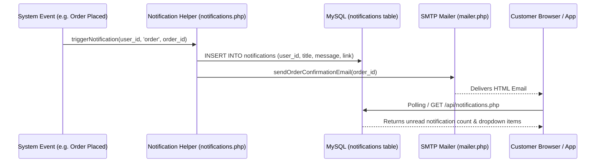

# Notification & Email System Specification

## 1. Overview

GroCo Grocery Store incorporates an automated multi-channel notification architecture covering:
1. **Transactional Emails** (via Custom SMTP Socket / PHPMailer engine in `public/includes/mailer.php`).
2. **In-App Customer Notifications** (stored in `notifications` table and rendered in customer dashboard / header bell).
3. **Admin Dashboard Alerts** (low stock alerts, new order notifications, system security events).
4. **SMS Gateway Abstraction Layer** (hooked for Bangladeshi SMS providers like SSLWireless, Greenweb, or Twilio).

---

## 2. Transactional Email Architecture (`public/includes/mailer.php`)

### 2.1 SMTP Configuration Settings
Configured via `settings` table in the database:
- `smtp_host`: Hostname (e.g., `smtp.gmail.com`, `mail.groco.site.je`).
- `smtp_port`: Port number (`587` for TLS, `465` for SSL, `25` for standard).
- `smtp_user`: Authentication username/email.
- `smtp_pass`: Encrypted/plaintext app password.
- `smtp_encryption`: `tls` or `ssl`.
- `smtp_from_email`: Display sender address (e.g., `noreply@groco.site.je`).
- `smtp_from_name`: Sender name (e.g., `GroCo Grocery Store`).

---

### 2.2 Email Template Inventory & Triggers

| Trigger Event | Template Identifier | Recipient | Subject Line | Core Content & Data Injected |
| :--- | :--- | :--- | :--- | :--- |
| **Customer Registration** | `welcome_email` | Customer | Welcome to GroCo Grocery Store! | Account confirmation, login link, first-order discount coupon code. |
| **Password Reset Request** | `password_reset` | Customer | Password Reset Request - GroCo | Secure token link with 1-hour expiration, IP address of requester, security warning. |
| **Order Placed (Online)** | `order_placed` | Customer | Order Confirmation - #{order_number} | Full itemized receipt, delivery address, shipping fee, total amount, estimated delivery date. |
| **New Order Alert (Admin)**| `admin_new_order` | Store Admin | [New Order] #{order_number} received | Customer name, order value, payment method (COD/Online), quick link to admin order review. |
| **Order Status Update** | `order_status_change` | Customer | Your Order #{order_number} is now {status} | Status banner (Processing, Shipped, Delivered), courier tracking code, contact helpline. |
| **Order Cancelled** | `order_cancelled` | Customer | Order Cancellation - #{order_number} | Cancellation reason, refund instructions if prepaid, apology voucher. |
| **Low Stock Warning** | `admin_low_stock` | Store Manager | [Warning] Product '{name}' is low on stock | Current stock level, reorder threshold, supplier contact details. |

---

## 3. HTML Email Layout Standards
All email templates share a responsive, table-based HTML layout compatible with Outlook, Gmail, Apple Mail, and Yahoo:
- **Header**: Brand logo, store contact line.
- **Body Card**: Clean card on subtle gray background (`#f4f6f9`), primary brand accents (`#2e7d32` green).
- **Footer**: Store physical address, support phone, unsubscribe/preferences link, copyright year.

---

## 4. In-App Notification Engine

### 4.1 Database Schema (`notifications` table)
```sql
CREATE TABLE `notifications` (
  `id` INT(11) NOT NULL AUTO_INCREMENT,
  `user_id` INT(11) NULL DEFAULT NULL COMMENT 'NULL for system-wide admin notifications',
  `admin_id` INT(11) NULL DEFAULT NULL COMMENT 'Target admin if admin-specific',
  `title` VARCHAR(255) NOT NULL,
  `message` TEXT NOT NULL,
  `type` ENUM('order', 'promo', 'stock', 'system', 'security') NOT NULL DEFAULT 'system',
  `link` VARCHAR(255) NULL DEFAULT NULL,
  `is_read` TINYINT(1) NOT NULL DEFAULT 0,
  `created_at` DATETIME NOT NULL DEFAULT CURRENT_TIMESTAMP,
  PRIMARY KEY (`id`),
  INDEX `idx_user_read` (`user_id`, `is_read`),
  INDEX `idx_admin_read` (`admin_id`, `is_read`)
) ENGINE=InnoDB DEFAULT CHARSET=utf8mb4 COLLATE=utf8mb4_unicode_ci;
```

### 4.2 Notification Lifecycle Flowchart


---

## 5. Implementation Requirements for Modernized Stack
1. **Background Job Queue**: Offload email sending to background worker queue (e.g., Redis + Celery/BullMQ/Laravel Queue) so web requests don't block on SMTP handshakes.
2. **Template Engine**: Use standardized templating (Twig / Blade / Handlebars / MJML) for responsive email rendering.
3. **Web Push & WebSockets**: Supplement polling with real-time WebSocket or Web Push API for instant order status toasts.
