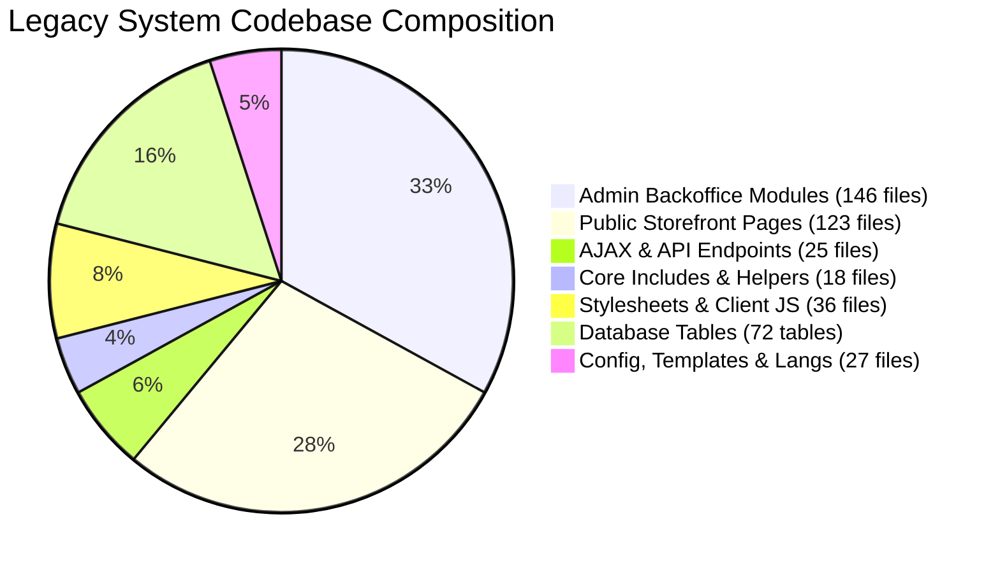

# GroCo Grocery Store: Complete Technical Blueprint & Reverse-Engineering Audit

## 1. Executive Summary

This document serves as the master blueprint and reverse-engineering audit for the **GroCo Grocery Store** e-commerce and retail ERP platform.

Every functional component, database table, business logic rule, calculation formula, security defense, and administrative module has been forensically extracted from the working PHP/MySQL codebase located at `C:\xampp\htdocs\grocery-store`.

> [!IMPORTANT]
> **Source Project Preservation**: The legacy application codebase has been kept strictly intact with zero modifications or deletions. All specifications below are documented to enable 100% feature parity during the construction of a modern replacement architecture.

---

## 2. Key System Metrics & Footprint



- **Total System Files**: 447 files across 38 directories.
- **Relational Database**: Exactly 72 relational tables in MariaDB / MySQL with full transactional integrity (`InnoDB`).
- **Core Currency & Locale**: Bangladeshi Taka (`BDT` / `৳`), Timezone `Asia/Dhaka`, Bilingual (English & Bengali).
- **Default Tax & Financial Baseline**: Standard VAT `0.00%` (dynamic), Base Shipping `৳ 60.00` (Dhaka) / `৳ 120.00` (Outside), Free Shipping threshold `৳ 1,500.00`, Minimum Order `৳ 100.00`.
- **Administrative Granularity**: 42 discrete role-based permissions across 51 backoffice functional views.

---

## 3. Master Index of Specification Documents

The complete technical blueprint is divided into 22 dedicated, in-depth architectural documents located in the `docs/` directory:

| Specification Document | File Path | Core Subject Matter |
| :--- | :--- | :--- |
| **Project Structure** | [`OLD_PROJECT_STRUCTURE.md`](file:///c:/xampp/htdocs/grocery-store/docs/OLD_PROJECT_STRUCTURE.md) | File-by-file directory map, inclusion chains, and dependencies. |
| **Customer Storefront** | [`CUSTOMER_FEATURE_INVENTORY.md`](file:///c:/xampp/htdocs/grocery-store/docs/CUSTOMER_FEATURE_INVENTORY.md) | Homepage, Catalog, Search, Quick View, Cart, Checkout, Profile, Orders. |
| **Auth & Permissions** | [`AUTHENTICATION_AND_AUTHORIZATION.md`](file:///c:/xampp/htdocs/grocery-store/docs/AUTHENTICATION_AND_AUTHORIZATION.md) | Customer auth, Google OAuth, session invalidation, Admin RBAC (42 perms). |
| **Admin Panel Inventory**| [`ADMIN_FEATURE_INVENTORY.md`](file:///c:/xampp/htdocs/grocery-store/docs/ADMIN_FEATURE_INVENTORY.md) | All 51 backoffice modules and management interfaces. |
| **POS Register Terminal** | [`POS_COMPLETE_SPECIFICATION.md`](file:///c:/xampp/htdocs/grocery-store/docs/POS_COMPLETE_SPECIFICATION.md) | Barcode scanner buffer, split payment, held orders, thermal receipts (80/58mm), shifts. |
| **Catalog System** | [`CATALOG_SYSTEM_SPECIFICATION.md`](file:///c:/xampp/htdocs/grocery-store/docs/CATALOG_SYSTEM_SPECIFICATION.md) | Products, categories, brands, variants, SKU, price/discounts, media. |
| **Cart & Checkout** | [`CART_CHECKOUT_BUSINESS_LOGIC.md`](file:///c:/xampp/htdocs/grocery-store/docs/CART_CHECKOUT_BUSINESS_LOGIC.md) | Hybrid cart, line item math, coupons, shipping tiers, VAT, atomic orders. |
| **Order Workflow** | [`ORDER_WORKFLOW.md`](file:///c:/xampp/htdocs/grocery-store/docs/ORDER_WORKFLOW.md) | 7-state order lifecycle, inventory restoration, invoice PDF generation. |
| **Inventory & ERP** | [`INVENTORY_BUSINESS_LOGIC.md`](file:///c:/xampp/htdocs/grocery-store/docs/INVENTORY_BUSINESS_LOGIC.md) | `inventory_logs` audit trail (7 movement types), adjustments, damaged goods write-offs. |
| **Finance & Accounting** | [`FINANCE_SYSTEM_SPECIFICATION.md`](file:///c:/xampp/htdocs/grocery-store/docs/FINANCE_SYSTEM_SPECIFICATION.md) | Expenses, daily drawer closing reconciliation, Gross Revenue, COGS, Net Profit. |
| **Database Schema** | [`LEGACY_DATABASE_SCHEMA.md`](file:///c:/xampp/htdocs/grocery-store/docs/LEGACY_DATABASE_SCHEMA.md) | Complete 72-table dictionary, column types, keys, indexes, and relationships. |
| **API & AJAX Specs** | [`API_AND_AJAX_SPECIFICATION.md`](file:///c:/xampp/htdocs/grocery-store/docs/API_AND_AJAX_SPECIFICATION.md) | All public and admin AJAX endpoints, methods, parameters, and responses. |
| **Client JavaScript** | [`JAVASCRIPT_FUNCTIONALITY.md`](file:///c:/xampp/htdocs/grocery-store/docs/JAVASCRIPT_FUNCTIONALITY.md) | Modular client-side JS architecture, toast, cart, debounced search, POS listener. |
| **Notifications & Mail**| [`NOTIFICATION_SYSTEM.md`](file:///c:/xampp/htdocs/grocery-store/docs/NOTIFICATION_SYSTEM.md) | SMTP engine, transactional email templates, in-app customer notification schema. |
| **Licensing System** | [`LICENSING_SYSTEM_SPECIFICATION.md`](file:///c:/xampp/htdocs/grocery-store/docs/LICENSING_SYSTEM_SPECIFICATION.md) | RSA-2048 signing, domain binding, 14-day grace period, lockout mechanisms. |
| **Security Inventory** | [`SECURITY_FEATURE_INVENTORY.md`](file:///c:/xampp/htdocs/grocery-store/docs/SECURITY_FEATURE_INVENTORY.md) | BCrypt hashing, CSRF tokens, XSS mitigation, prepared SQL, IDOR defenses. |
| **SEO Architecture** | [`SEO_FEATURE_INVENTORY.md`](file:///c:/xampp/htdocs/grocery-store/docs/SEO_FEATURE_INVENTORY.md) | Schema.org JSON-LD, automated XML sitemaps with images, canonicals. |
| **PWA & Mobile** | [`PWA_AND_MOBILE_SPECIFICATION.md`](file:///c:/xampp/htdocs/grocery-store/docs/PWA_AND_MOBILE_SPECIFICATION.md) | Web manifest, service worker caching, offline fallback, mobile nav bar. |
| **Multi-Language (i18n)**| [`LANGUAGE_SYSTEM.md`](file:///c:/xampp/htdocs/grocery-store/docs/LANGUAGE_SYSTEM.md) | English/Bengali dictionaries, `t()` helper, Bangla numeral localization. |
| **System Settings** | [`SYSTEM_SETTINGS.md`](file:///c:/xampp/htdocs/grocery-store/docs/SYSTEM_SETTINGS.md) | Key-value store dictionary for all 38+ system configuration parameters. |
| **Master Matrix** | [`MASTER_FEATURE_MAPPING.md`](file:///c:/xampp/htdocs/grocery-store/docs/MASTER_FEATURE_MAPPING.md) | End-to-end matrix mapping Feature $\rightarrow$ UI $\rightarrow$ Controller $\rightarrow$ API $\rightarrow$ DB. |
| **Implementation Plan** | [`NEW_PROJECT_IMPLEMENTATION_CHECKLIST.md`](file:///c:/xampp/htdocs/grocery-store/docs/NEW_PROJECT_IMPLEMENTATION_CHECKLIST.md) | 26-section (A–Z) execution roadmap for building the new modernized project. |

---

## 4. Architectural Summary for Modernization

```mermaid
graph TD
    subgraph Frontend Layer
        Web[Customer Storefront Web / Mobile PWA]
        AdminUI[Backoffice Admin Portal]
        POSUI[POS Cashier Register Station]
    end

    subgraph Application & Security Gateway
        AuthGuard[Auth Middleware & RBAC]
        RateLimiter[Rate Limiter & CSRF Guard]
        Router[API & Page Controller Router]
    end

    subgraph Core Business Services
        CatalogSvc[Catalog & Search Service]
        CartSvc[Cart & Checkout Engine]
        OrderSvc[Order State Machine & Invoicing]
        InventorySvc[Inventory ERP & Stock Audit Trail]
        FinanceSvc[Finance, Ledger & Expense Accounting]
        NotifySvc[SMTP Mailer & Notification Dispatcher]
    end

    subgraph Persistence Layer
        DB[(72-Table Relational Database)]
        Storage[(Media & Secure Uploads)]
        Cache[(In-Memory Cache / Sessions)]
    end

    Frontend Layer --> Application & Security Gateway
    Application & Security Gateway --> Core Business Services
    Core Business Services --> Persistence Layer
```

### Strategic Recommendations for the New Modern Stack:
1. **Separation of Frontends**: Consider separating the public Customer Storefront (optimized for SSR/SEO and mobile performance) from the Backoffice Admin & POS Terminal (optimized for high-density desktop data grids and fast barcode entry).
2. **Atomic Inventory Control**: Maintain the strict transactional locking around stock movements established in the legacy system (`inventory_logs` audit trail for every single quantity change).
3. **Queue-Backed Communications**: Transition SMTP email dispatching from synchronous HTTP calls to asynchronous background queues for sub-second user response times.
4. **Environment-Driven Configuration**: Replace static database configurations for credentials with 12-factor `.env` environment variables while retaining dynamic business settings (shipping fees, minimum order amounts, tax rates) in the database.
