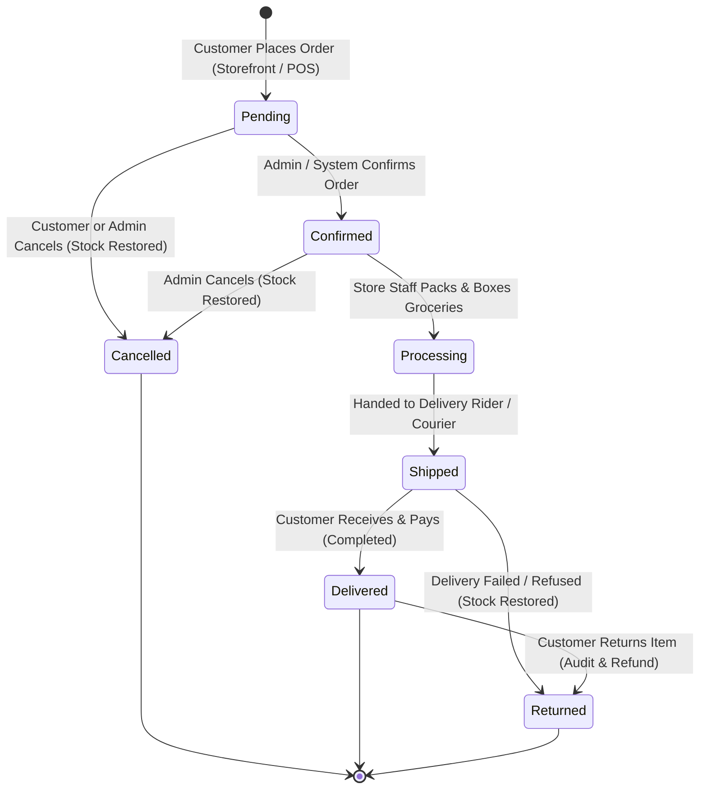

# GroCo Grocery Store — Order Workflow & Lifecycle Specification

This document details the complete end-to-end lifecycle of an order from creation through packing, dispatch, delivery, cancellation, and returns.

---

## 1. Order Status State Machine



---

## 2. Order Status Definitions & Verification

| Status String | Human Label | Operational Meaning | Stock Impact |
| :--- | :--- | :--- | :--- |
| `pending` | **Pending Approval** | Order received by system; waiting for order review or automated fraud check. | Stock was already deducted at checkout. |
| `confirmed` | **Order Confirmed** | Store manager reviewed address and inventory; order accepted for fulfillment. | Stock remains reserved. |
| `processing` | **Packaging / Packing** | Store staff physically gathers grocery items, inspects freshness, and packs boxes/bags. | Stock remains reserved. |
| `shipped` | **Out for Delivery** | Order loaded onto delivery vehicle / assigned to rider with scheduled delivery slot. | Stock remains reserved. |
| `delivered` | **Delivered** | Customer received items and signed off. If COD, cash was collected by rider. | Sale finalized. |
| `cancelled` | **Cancelled** | Order aborted prior to delivery (e.g. customer request or invalid address). | **Stock Automatically Restored** (`+quantity`). |
| `returned` | **Returned / Rejected** | Customer rejected order at doorstep or returned perishable/defective items. | **Stock Restored** upon warehouse check. |

---

## 3. Order Data Model

### A. Master Order Record (`orders`)
* `id` (`INT(11) AUTO_INCREMENT PRIMARY KEY`)
* `order_number` (`VARCHAR(50) UNIQUE` &mdash; e.g. `ORD-20260926-8492`)
* `invoice_number` (`VARCHAR(50) UNIQUE` &mdash; e.g. `INV-20260926-1048`)
* `user_id` (`INT(11) NULL` &rarr; `users.id` &mdash; NULL for walk-in POS sales)
* `order_type` (`ENUM('online', 'pos', 'phone') DEFAULT 'online'`)
* `status` (`ENUM('pending', 'confirmed', 'processing', 'shipped', 'delivered', 'cancelled', 'returned') DEFAULT 'pending'`)
* `payment_status` (`ENUM('unpaid', 'paid', 'partially_paid', 'refunded', 'failed') DEFAULT 'unpaid'`)
* `payment_method` (`VARCHAR(50)` &mdash; `cod`, `bkash`, `nagad`, `sslcommerz`, `card`, `split`, `cash`)
* `subtotal` (`DECIMAL(10,2)`)
* `discount_amount` (`DECIMAL(10,2) DEFAULT 0.00`)
* `coupon_code` (`VARCHAR(50) NULL`)
* `delivery_charge` (`DECIMAL(10,2) DEFAULT 0.00`)
* `vat_amount` (`DECIMAL(10,2) DEFAULT 0.00`)
* `total_amount` (`DECIMAL(10,2)` &mdash; Net payable)
* `paid_amount` (`DECIMAL(10,2) DEFAULT 0.00`)
* `delivery_address` (`TEXT NULL` &mdash; Full delivery address snapshot)
* `delivery_date` (`DATE NULL`)
* `delivery_time_slot` (`VARCHAR(100) NULL` &mdash; e.g. *"Morning (8:00 AM - 12:00 PM)"*)
* `delivery_rider_id` (`INT(11) NULL` &rarr; `delivery_boys.id`)
* `notes` (`TEXT NULL`)
* `created_at`, `updated_at`

### B. Order Line Items (`order_items`)
* `id` (`INT(11) AUTO_INCREMENT PRIMARY KEY`)
* `order_id` (`INT(11)` &rarr; `orders.id` ON DELETE CASCADE)
* `product_id` (`INT(11)` &rarr; `products.id`)
* `product_name` (`VARCHAR(255)` &mdash; Item name snapshot at time of purchase)
* `sku` (`VARCHAR(50) NULL`)
* `unit_price` (`DECIMAL(10,2)`)
* `quantity` (`INT(11)`)
* `total_price` (`DECIMAL(10,2)` &mdash; `unit_price * quantity`)

### C. Status Audit Timeline (`order_status_history`)
* `id` (`INT(11) AUTO_INCREMENT PRIMARY KEY`)
* `order_id` (`INT(11)` &rarr; `orders.id`)
* `status` (`VARCHAR(50)`)
* `notes` (`TEXT NULL`)
* `changed_by` (`VARCHAR(100)` &mdash; System / Customer / Admin Username)
* `created_at` (`TIMESTAMP DEFAULT CURRENT_TIMESTAMP`)

---

## 4. Delivery Assignment Workflow

1. In `admin/orders/view.php` or `admin/delivery/assign.php`, the store dispatcher selects an active order with status `confirmed` or `processing`.
2. Dispatcher assigns a registered rider from `delivery_boys` (`status = 'active'`).
3. System updates:
   * `orders.delivery_rider_id = :rider_id`
   * `orders.status = 'shipped'`
   * Inserts into `delivery_assignments`: `(order_id, rider_id, assigned_at, status='assigned')`.
4. Rider delivers package, collects COD cash, and marks order as `delivered`.

---

## 5. Cancellation & Inventory Restoration Logic

* **Trigger:** Customer cancels order via `public/orders.php` (only permitted if status is `pending`) OR Admin cancels order via back-office (`admin/orders/update-status.php`).
* **Atomic Execution:**
  ```text
  1. START TRANSACTION;
  2. UPDATE orders SET status = 'cancelled', updated_at = NOW() WHERE id = :order_id;
  3. Query all items: SELECT product_id, quantity FROM order_items WHERE order_id = :order_id;
  4. For each item:
     - UPDATE products SET stock = stock + :quantity WHERE id = :product_id;
     - INSERT INTO inventory_logs (product_id, type, quantity, reference_id, notes, created_at)
       VALUES (:product_id, 'order_cancellation', :quantity, :order_id, 'Restored from cancelled order', NOW());
  5. INSERT INTO order_status_history (order_id, status, notes, changed_by)
     VALUES (:order_id, 'cancelled', 'Order cancelled and stock restored to inventory', :admin_or_user);
  6. COMMIT TRANSACTION;
  ```
