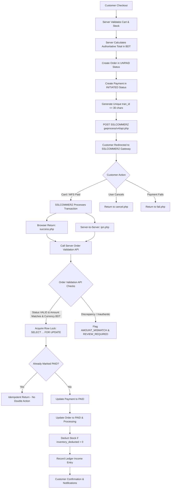

# GroCo Grocery Store — Enterprise Payment Gateway Architecture

## 1. Architectural Overview

The GroCo Grocery Store payment subsystem delivers a real-world, production-grade financial architecture modeled after leading enterprise e-commerce platforms in Bangladesh. It establishes the backend server as the sole and final authority for payment validation, order finalization, and inventory deductions.

---

## 2. Identifier Separation Model

A critical flaw in substandard payment implementations is the conflation of different system identifiers. GroCo strictly decouples four distinct transaction entities:

| Identifier | Format / Example | Length Constraint | Purpose | Authority |
|---|---|---|---|---|
| **Internal Order ID / Number** | `ORD-20261007-45B12539` | Standard VARCHAR(30) | Customer-facing receipt & fulfillment tracking | GroCo Order Subsystem |
| **Payment Attempt ID** | `PAY-10025-01` | VARCHAR(50) | Differentiates consecutive retry attempts for the same order | Internal Payment Service |
| **Gateway Transaction ID (`tran_id`)** | `GRO-10025-P1-B1A573BE` | Max 30 chars (SSLCOMMERZ constraint) | Unique merchant transaction ID sent to SSLCOMMERZ | Internal Payment Service (Server-Generated) |
| **Bank Transaction ID (`bank_tran_id`)** | `151114130739NelA2` | VARCHAR(100) | Originating banking network / MFS clearing reference | Gateway / Acquirer Bank |
| **Validation ID (`val_id`)** | `2610072215392819` | VARCHAR(100) | Token used for server-to-server Order Validation API | SSLCOMMERZ Gateway |

---

## 3. Financial Integrity & Zero-VAT BDT Model

- **Authoritative Monetary Type**: Stored strictly as `DECIMAL(12,2)`. Floating-point types (`FLOAT`, `DOUBLE`) are strictly banned from monetary tables and calculations.
- **Micro-Discrepancy Guard**: Tolerances for gateway amount validation are clamped to strict `<= 0.009` BDT threshold using `round(abs($valAmount - $orderAmount), 2) < 0.01`.
- **Currency Enforcement**: Stated strictly as `BDT` (Bangladeshi Taka). The client browser is never permitted to dictate currency. Gateway responses declaring other currencies (e.g. `USD`, `EUR`) are rejected immediately with security audit alerts.
- **Zero-VAT Policy**: Bangladesh basic grocery items comply with 0% VAT configuration, calculated server-side without reliance on client inputs.

---

## 4. Multi-Channel Support

The SSLCOMMERZ V4 integration automatically exposes all available payment instruments enabled for the merchant store:
1. **Cards**: Visa, MasterCard, American Express, UnionPay, DBBL Nexus.
2. **Mobile Financial Services (MFS)**: bKash, Nagad, Rocket, Upay, Tap, OK Wallet.
3. **Internet Banking**: City Touch, Islami Bank (i-Banking), BRAC Bank, MTBL, Pubali Bank.
4. **Cash on Delivery (COD)**: Fully preserved for customers preferring offline payment at delivery.
