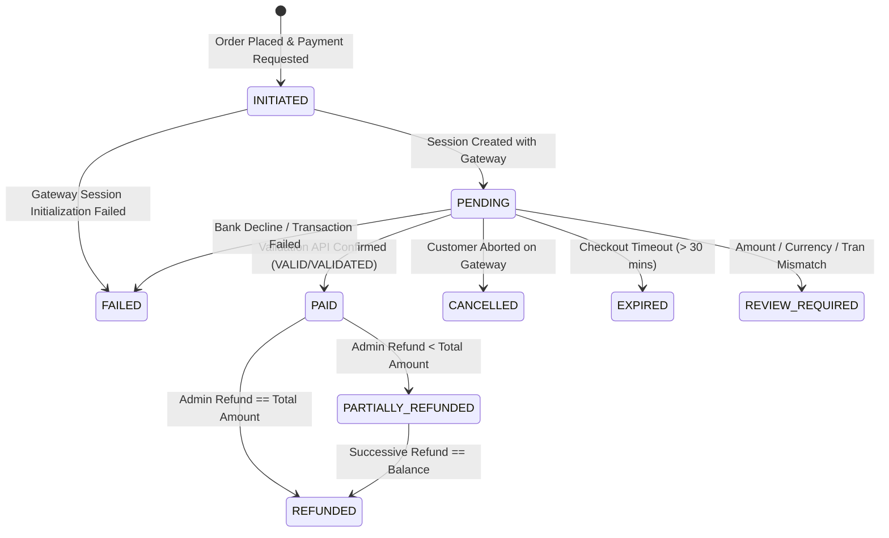

# GroCo Grocery Store — Payment State Machine & Lifecycle

## 1. Payment Lifecycle States

The `payments.status` column operates under a finite state machine governed by `public/includes/PaymentService.php`:

---

## 2. Permitted Transitions Matrix

| From State | Allowed Target States | Disallowed Regressions / Notes |
|---|---|---|
| `INITIATED` | `PENDING`, `FAILED` | Cannot transition directly to `PAID` without session generation. |
| `PENDING` | `PAID`, `FAILED`, `CANCELLED`, `EXPIRED`, `REVIEW_REQUIRED` | Cannot transition directly to `REFUNDED`. |
| `PAID` | `PARTIALLY_REFUNDED`, `REFUNDED` | **IMMUTABLE**: Late arrival of `FAILED`, `CANCELLED`, or `PENDING` is strictly ignored and logged. |
| `FAILED` | None (Final for this attempt) | Customer can launch a new payment attempt with fresh `tran_id`. |
| `CANCELLED` | None (Final for this attempt) | Customer can launch a new payment attempt with fresh `tran_id`. |
| `PARTIALLY_REFUNDED` | `REFUNDED` | Cannot transition back to `PAID`. |
| `REFUNDED` | None (Terminal state) | No further status changes permitted. |
| `REVIEW_REQUIRED` | `PAID`, `FAILED` (Manual Admin Resolution) | Locked against automatic state transitions until admin investigation. |

---

## 3. Order Status Synchronization

When `payments.status` transitions, `orders.payment_status` and `orders.status` are updated inside a single atomic database transaction:

| Event | `payments.status` | `orders.payment_status` | `orders.status` | `orders.inventory_deducted` |
|---|---|---|---|---|
| Order Created | `INITIATED` | `unpaid` | `pending` | `1` |
| Session Generated | `PENDING` | `unpaid` | `pending` | `1` |
| Gateway Success Verified | `PAID` | `paid` | `processing` | `1` |
| Payment Declined | `FAILED` | `failed` | `pending` (allows retry) | `1` (or restored on cancel) |
| Customer Cancelled | `CANCELLED` | `cancelled` | `pending` (allows retry) | `1` |
| Partial Refund | `PARTIALLY_REFUNDED`| `partially_refunded` | Unchanged | `1` |
| Full Refund | `REFUNDED` | `refunded` | `cancelled` | `0` (stock restored) |
| Amount Discrepancy | `REVIEW_REQUIRED` | `unpaid` | `pending` | `1` |

---

## 4. Idempotency & Concurrency Rules

1. **Row-Level Exclusive Locks**:
   Every state modification acquires a pessimistic lock (`SELECT ... FOR UPDATE`) on both `payments` and `orders` tables.
2. **First-Wins Authority**:
   Whichever process verifies first (whether customer browser return at `success.php` or server webhook at `ipn.php`) finalizes the state to `PAID`.
3. **Subsequent Notification Acknowledgment**:
   When the second notification arrives, the check `if ($oldStatus === 'PAID')` immediately logs an `IDEMPOTENT_DUPLICATE_ACCEPTED` audit trail event and returns success without executing duplicate operations.
