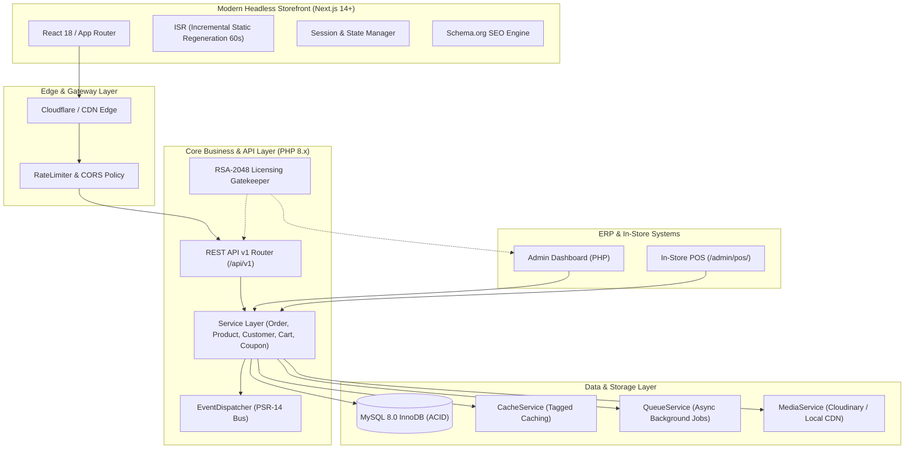

# GroCo Grocery Store — Phase 3 Headless Architecture

## 1. System Architecture Overview

GroCo Grocery Store operates in a modern **Decoupled / Headless Architecture** providing maximum flexibility, lightning-fast storefront user experiences, and rock-solid operational ERP and POS continuity.

---

## 2. Storefront Modernization (Next.js 14 App Router)

- **Framework**: Next.js 14.2.5 with App Router (`app/` directory).
- **Core Technology**: React 18+, TypeScript 5.4, Tailwind CSS 3.4, Lucide Icons.
- **Data Fetching Paradigm**:
  - `fetchApi<T>()` client wrapper with automatic error parsing, credentials handling, and strongly typed `ApiResponse<T>`.
  - Server Components utilize Next.js data cache with `revalidate: 60` for catalog pages.
  - Client Components handle user cart mutations, coupon validation, checkout state, and profile editing.

---

## 3. Data Contracts & Type Safety

All backend REST API v1 payloads are mirrored 1:1 in TypeScript interface definitions located at `frontend/types/index.ts`:

- `Product`: Complete entity schema including discount pricing, unit metadata, responsive image URLs, rating counters.
- `Category` & `Brand`: Hierarchical entities with asset thumbnails.
- `CartItem` & `CartResponse`: Server-calculated line totals, strictly Zero-VAT compliant totals.
- `Order` & `OrderItem`: Detailed order tracking status, payment methods (`cod`, `card`, `mobile_banking`).
- `ApiResponse<T>`: Unified JSON envelope with `status`, `data`, `meta`, `timestamp`, and `request_id`.

---

## 4. Operational Invariants & ERP/POS Continuity

1. **Admin ERP & POS Preserved**: Native PHP administrative back-office and in-store point-of-sale (`admin/pos/index.php`) remain 100% operational with zero disruption.
2. **Database Integrity**: MySQL 8.0 InnoDB schema is maintained with strict ACID constraints, transactions, and row-level locking (`FOR UPDATE`) for inventory deduction.
3. **Licensing System**: RSA-2048 cryptographic licensing gatekeeper validates license status for all back-office operations.
4. **Price Authority**: All calculations (subtotals, discounts, delivery fees, line totals) are computed server-side in PHP to prevent client-side price tampering.
