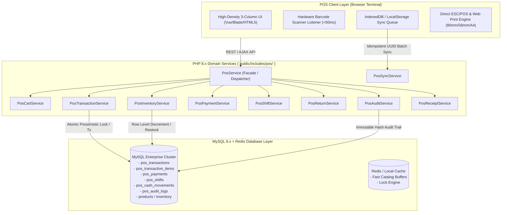

# GroCo Enterprise POS V2 — Architecture & Design Document (2026)

## Executive Summary
GroCo Enterprise POS V2 is an omnichannel, high-throughput retail terminal and supermarket ERP subsystem designed for physical multi-lane grocery store environments (similar to Shopno / Chaldal retail depots) seamlessly synchronized with online grocery e-commerce orders.

---

## High-Level Architecture Diagram

---

## 1. Domain Service Layer Decomposition

The backend engine follows strict Domain-Driven Design (DDD) principles located under `public/includes/pos/`:

1. **`PosService` (Unified Facade)**
   - Single point of entry coordinating domain subsystems.
   - Dual interface providing both singular and plural method aliases (e.g. `$pos->transaction()` and `$pos->transactions()`) ensuring 100% backward and modern API compatibility.

2. **`PosCartService` (Pricing & Weight Engine)**
   - High-precision decimal arithmetic for weighted produce (kg, gm, liter, ml, pcs).
   - Multi-tier discount stacking (item-level promotions + cart percentage/fixed vouchers) with strict configurable manager thresholds (`pos_max_discount_pct`).

3. **`PosTransactionService` (Atomic Checkout Engine)**
   - Guarantees ACID compliance with pessimistic row locking (`FOR UPDATE`).
   - Generates unique sequence transaction numbers (`GR-YYYYMMDD-XXXX`).
   - Automatically maintains dual-record compatibility: writes to `pos_transactions` + `pos_transaction_items` while simultaneously populating legacy `orders` and `order_items` tables for existing dashboards.

4. **`PosInventoryService` (Real-Time Stock Orchestration)**
   - Prevents stock overselling under concurrent multi-lane load using atomic decrement statements (`UPDATE products SET stock = stock - ? WHERE id = ? AND stock >= ?`).
   - Immediate stock restoration on item returns or voided transactions.

5. **`PosPaymentService` (Split Tender & Gateway Processor)**
   - Supports multi-tender transactions (Cash, bKash, Nagad, Visa/Mastercard, Customer Wallet, Loyalty Points).
   - Validates payment totals against payable grand totals, calculating change due or wallet balance deductions.

6. **`PosShiftService` (Cash Register & Drawer Management)**
   - Implements full Opening Float, Mid-Shift Cash-In / Cash-Out (Petty Cash), and Closing Count reconciliation.
   - Generates instantaneous X-Readings (mid-shift snapshot) and Z-Readings (end-of-shift permanent ledger with overage/shortage calculations).

7. **`PosReturnService` (Itemized Returns & Restocking)**
   - Validates returns against original transaction items and prevents return quantity exceeding purchased quantity.
   - Restocks inventory in real-time and logs financial refund entries.

8. **`PosSyncService` (Offline Batch Engine)**
   - Handles offline-captured transactions via unique client-side UUIDs (`offline_uuid`).
   - Implements idempotent transaction processing to eliminate double-billing or duplicate stock decrements during network reconnection.

9. **`PosAuditService` (Forensic Security & Compliance)**
   - Logs all critical cashier events (price overrides, drawer openings, manual discounts, voided items, returns, shift closures) into `pos_audit_logs` with IP, Cashier ID, timestamp, and metadata payload.

10. **`PosReceiptService` (Receipt & Slip Generation)**
    - Multi-format thermal receipt rendering (80mm thermal receipt, 58mm mini slip, A4 tax invoice).
    - QR Code and barcode generation for fast scanner returns.

---

## 2. Omnichannel Data Consistency

Physical POS sales and online grocery e-commerce orders operate on a unified MySQL schema:
- **Shared Products & SKUs**: `products` table is the single source of truth for stock, prices, and barcodes.
- **Dual Order Registry**: When a physical POS transaction is finalized, `pos_transactions` records the in-store terminal metadata (cashier_id, shift_id, store_id, register_id, offline_uuid) while a shadow row in `orders` is generated with `source = 'pos'` and `payment_status = 'paid'`, ensuring existing accounting reports, analytics charts, and finance ledgers reflect in-store revenue automatically.
