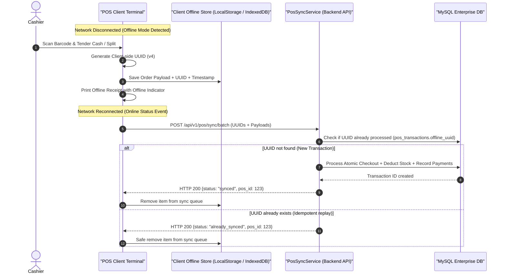

# GroCo Enterprise POS V2 — Offline Mode & Sync Protocol

## Overview
In retail supermarket operations, temporary network drops, LAN latency, or internet outages must not stop checkout lanes. GroCo POS V2 incorporates an offline-first transaction queue and idempotent synchronization protocol.

---

## 1. Offline Architecture & Data Flow

---

## 2. Idempotency Guarantees
Every offline transaction generates a unique UUID `offline_uuid` (RFC 4122 v4) in JavaScript prior to saving in local storage:
1. `pos_transactions` contains a unique index on `offline_uuid`.
2. When `PosSyncService::syncTransaction()` or `PosTransactionService::createTransaction()` receives an `offline_uuid`:
   - An initial query checks `SELECT id FROM pos_transactions WHERE offline_uuid = ?`.
   - If a record exists, the service immediately returns the existing transaction data with an `idempotent_hit: true` response.
   - Database locks and stock decrements are completely bypassed, preventing duplicate inventory deductions or duplicate payment captures.

---

## 3. Conflict Resolution & Stock Management
- If an item was sold offline when online stock was subsequently depleted by online e-commerce shoppers, the offline physical in-store sale takes priority.
- The transaction processes successfully with negative stock variance flagging, triggering an automatic low-stock/reorder alert in `pos_audit_logs`.
