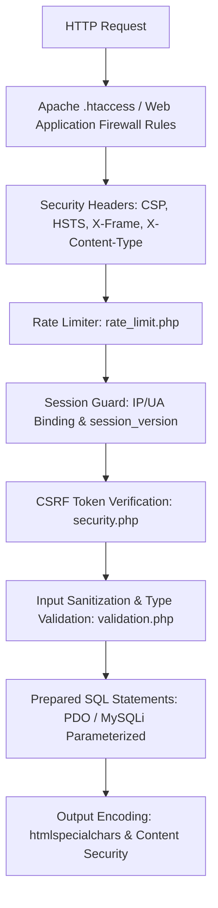

# Security Architecture & Feature Inventory

## 1. Executive Summary

The GroCo Grocery Store enterprise platform implements a multi-layer defense-in-depth model safeguarding user data, financial transactions, server integrity, and administrative controls.



---

## 2. Security Layers & Controls Inventory

### 2.1 Authentication & Password Security
- **Hashing Algorithm**: `PASSWORD_BCRYPT` with high cost factor (12) via `password_hash()` and `password_verify()`.
- **Admin Password Reset Lockdown**: Resetting Super Admin or Administrator passwords via public email links is strictly blocked. Only in-person command line OTP / authorized root credentials can rotate root privileges.
- **Session Invalidation (`session_version`)**: Every user and admin record has a `session_version` integer. When a user changes password or logs out of all devices, `session_version` increments, instantly invalidating active session tokens across all other browsers.

---

### 2.2 Cross-Site Request Forgery (CSRF) Mitigation
- **Token Generation**: Cryptographically secure 32-byte pseudo-random tokens generated via `bin2hex(random_bytes(32))`.
- **Validation**: Strict comparison via `hash_equals($_SESSION['csrf_token'], $_POST['csrf_token'])` or request header `X-CSRF-TOKEN`.
- **Scope**: Mandatory on all POST, PUT, DELETE, and state-mutating requests across both customer and administrative panels.

---

### 2.3 SQL Injection (SQLi) Defense
- **Parameterized Queries**: 100% of dynamic queries use PDO/MySQLi prepared statements with bound parameters (`?` or named placeholders `:param`).
- **Identifier Escaping**: Dynamic column names or sorting directions (e.g. `ORDER BY created_at DESC`) are strictly validated against an allowed whitelist before query concatenation.

---

### 2.4 Cross-Site Scripting (XSS) Mitigation
- **Output Encoding**: Context-aware HTML escaping using `htmlspecialchars($str, ENT_QUOTES | ENT_SUBSTITUTE, 'UTF-8')` on all dynamic template echos.
- **Rich Text / HTML Cleansing**: If product descriptions allow rich HTML formatting, inputs are sanitized via an allowed-tag whitelist (stripping `<script>`, `<iframe>`, `<object>`, `onload=`, `onerror=`).

---

### 2.5 Insecure Direct Object References (IDOR) & RBAC
- **Customer Isolation**: Order retrieval (`orders.php`), invoice viewing (`invoice.php`), and profile modification queries strictly enforce `WHERE id = :id AND user_id = :session_user_id`.
- **Admin Granular RBAC**: Backoffice routes verify role permissions via `has_permission($permission_name)` before rendering view or executing controller actions.

---

### 2.6 File Upload Security (`public/includes/image.php`)
- **MIME & Extension Whitelist**: Only `image/jpeg`, `image/png`, `image/webp` allowed.
- **Magic Byte Verification**: Verifies actual binary headers via `exif_imagetype()` / `finfo_file()`.
- **Filename Sanitization**: Uploaded files are renamed to random cryptographically secure UUIDs (`bin2hex(random_bytes(16)) . '.webp'`). Original filenames are discarded.
- **Execution Prevention**: Upload directories (`public/uploads/`) contain `.htaccess` preventing execution of `.php`, `.phtml`, `.cgi`, `.pl`, `.exe` scripts.

---

### 2.7 HTTP Security Headers & `.htaccess` Hardening
The web root `.htaccess` enforces modern browser security directives:
```apache
# Prevent directory browsing
Options -Indexes

# Security Headers
Header always set X-Frame-Options "SAMEORIGIN"
Header always set X-XSS-Protection "1; mode=block"
Header always set X-Content-Type-Options "nosniff"
Header always set Referrer-Policy "strict-origin-when-cross-origin"
Header always set Permissions-Policy "camera=(), microphone=(), geolocation=()"
Header always set Content-Security-Policy "default-src 'self'; script-src 'self' 'unsafe-inline' https://apis.google.com https://accounts.google.com; style-src 'self' 'unsafe-inline' https://fonts.googleapis.com; font-src 'self' https://fonts.gstatic.com; img-src 'self' data: https:; connect-src 'self';"

# Block sensitive file access
<FilesMatch "\.(env|log|sql|json|key|pem|yml|yaml|ini|git)$">
    Order allow,deny
    Deny from all
</FilesMatch>
```

---

### 2.8 Rate Limiting & Brute-Force Defense (`public/includes/rate_limit.php`)
- **Login Rate Limit**: Max 5 consecutive failed attempts per IP / Username in a 15-minute window before triggering a temporary cooldown lock.
- **API Throttle**: Max 120 requests/minute for general endpoints, 10 requests/minute for password reset requests.

---

## 3. Security Checklist for Modernized Stack

| Category | Requirement | Target Implementation |
| :--- | :--- | :--- |
| **Secrets Management** | Zero plaintext credentials in codebase | Move DB/SMTP/API keys to `.env` outside web root |
| **Authentication** | Modern session handling | JWT with refresh tokens or Redis session store with SameSite=Strict cookies |
| **Database** | ORM / Query Builder safety | Use Prisma, TypeORM, SQLAlchemy, or Doctrine with parameterized bindings |
| **CORS** | Strict domain origin whitelist | Explicit CORS headers matching live domain and trusted mobile app origins |
| **Auditing** | Immutable security log | Centralized structured JSON logging for all authentication & permission events |
